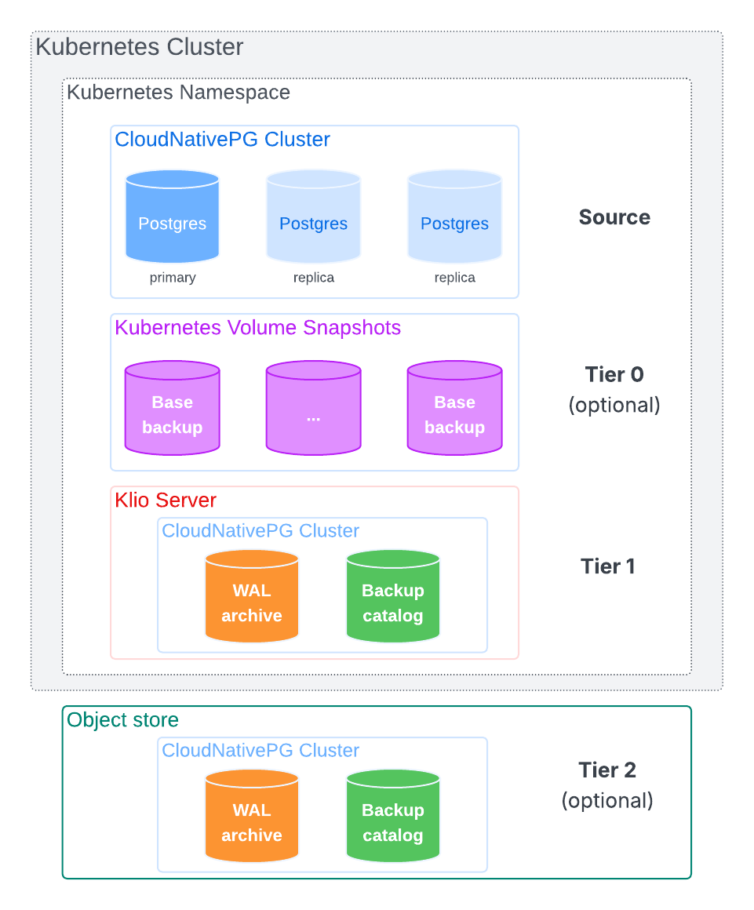

# Klio Overview

**Klio** is a cloud-native solution for enterprise-grade backup and recovery of
PostgreSQL databases managed by [CloudNativePG](https://cloudnative-pg.io) on
Kubernetes. It is designed to handle:

- The **Write-Ahead Log (WAL) archive** for a given PostgreSQL `Cluster`
  resource, within the same Kubernetes namespace as the Klio deployment
- The **catalog of physical base backups** for that same cluster
- Optionally, multiple PostgreSQL clusters in the same namespace

These critical backup artifacts are stored across two distinct storage tiers:

- Tier 1 – **Local Volume**: A local Persistent Volume Claim (PVC) within the
  same namespace as the associated `Cluster` resource. It offers immediate,
  high-throughput access for backup and recovery operations. Also referred to as
  the **Main Tier** or **Klio Server**.

- Tier 2 – **Secondary Storage**: An external object storage system where data
  from Tier 1 is asynchronously replicated. This tier typically resides outside
  the Kubernetes cluster, enabling geographical redundancy and enhancing disaster
  recovery (DR) resilience.

---

## Key Features

:::note
Most of the following features are currently aspirational and under active
development.
:::

### WAL Management

- Native WAL streaming from the primary, eliminating the need for
  `archive_command`, with support for:

  - Partial WAL file handling
  - WAL file compression
  - WAL file encryption using user-provided keys
  - Controlled replication slot advancement to ensure uninterrupted streaming
  - Synchronous replication

- WAL archive storage on a local PVC (Tier 1)
- Extension of base backup retention policy enforcement to WAL files
- Asynchronous WAL relay to Tier 2 object storage

### Base Backup Catalog

- Physical online base backups from the primary node to Tier 1, with support
  for:

  - Data deduplication for efficient remote incremental backups
  - Compression to optimize storage usage
  - Encryption using user-provided keys for data confidentiality

- Backup catalog stored on a file system Persistent Volume Claim (PVC) in Tier 1
- Integration with CloudNativePG Kubernetes Volume Snapshots (Tier 0),
  enabling asynchronous offload to Tier 1 using the same physical backup
  process
- Retention policy enforcement based on defined recovery windows, including
  Kubernetes Volume Snapshots
- Asynchronous replication of base backups to Tier 2 object storage for
  long-term durability and disaster recovery (DR)

:::important
Kubernetes Volume Snapshot integration (Tier 0) is only available for storage
classes that support volume snapshots.
:::

### General Capabilities

- End-to-end encryption: both in-transit and at-rest
- Designed for seamless integration with Kubernetes-native data protection
  tools such as Veeam Kasten, Velero, and others
- Delivered as a CNPG-I plugin, with an accompanying Kubernetes Operator
- Available as a Certified Red Hat OpenShift Operator
- Distributed via a Helm chart for streamlined deployment
